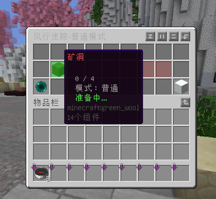
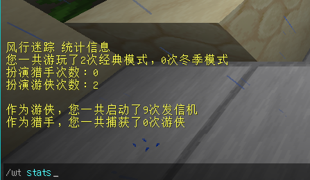

# 
 WindTrace 风行迷踪MC版 

[简体中文](/help/README_zh.md)      [English](/help/README_en.md)

本插件允许您将游戏《原神》中有时复刻的热门玩法”风行迷踪“添加到您的Minecraft 服务器中。

## 如果您是普通玩家...

游戏分为两种模式，一种为普通模式，另一种为冬季模式。不同模式下对于游侠的胜利条件判定不一致。

在游戏中，您需要扮演以下角色：

- 猎手：尽可能快地将游戏内所有游侠捕捉，以赢得胜利。在距离游戏结束60秒时，猎手会获得加强，其移动速度大幅提升，「捕获！」的冷却时间缩短。
- 游侠：在普通模式中，您需要尽快修复地图上的所有发信机，以赢得胜利；在冬季模式中，您需要尽可能存活长的时间，直到游戏结束。

### 发信机

在普通模式下出现。默认条件下，单人修复时间为20秒，每增加一个玩家会使修复效率提高30%。

### 暖源

在冬季模式下出现。默认条件下，单人激活时间为5秒，激活后会持续降低周围玩家的寒冷值。

### 寒冷值

该机制存在于冬季模式下，当玩家角色为游侠且未处于暖源附近时，寒冷值每秒增加3点。若寒冷值达到最大，玩家将会进入10秒的冻结状态。

### 技能

所有模式下同一角色的技能一致。未来我们可能考虑添加更多的技能。
对于猎手：

- 感应光环：探测周围区域，若存在游侠则标记其5秒内移动轨迹。冷却4秒，可用3次。
- 捕获！：揭穿附近游侠伪装并捕获，其将直接被淘汰。冷却5秒，可用3次。当游戏进入最后60秒时，该技能的冷却变为3秒。
- 禁锢咒法：随机解除一名游侠伪装并禁锢10秒，期间无法离开区域，无法被捕获。此为「眷顾之力」技能。

对于游侠：

- 透明戏法：进入5秒隐匿状态，解除当前伪装。冷却30秒。
- 伪装：随机变为场景物件或解除。无冷却。
- 星步疾行：30秒内大幅提升移动速度。此为「眷顾之力」技能。

> 💡「眷顾之力」技能在拾取「眷顾之力」后获得，且一局游戏只能使用一次。

### 指令

作为普通玩家，您可以使用的命令有：

- /wt join 这会打开一个可用游戏列表菜单，允许您选择游戏并加入。

- /wt stats 您可以使用该命令获取统计数据。

## 如果您是管理员...
要创建一个地图，请按照顺序执行以下操作：
1. 检查前置： 

必要前置：
- [Holographic Displays](https://dev.bukkit.org/bukkit-plugins/holographic-displays)

可选前置：
- [ProtocolLib](https://spigotmc.org/resources/protocollib.1997/)
- [LibsDisguises](https://github.com/libraryaddict/LibsDisguise)（这个不装可能会报错，因为我bug不想修）

> ~~别问为什么Holographic Displays这么不起眼却是必要前置，问就是史山代码不好改[doge]~~
2. 站在大厅处，使用`/wt setLobby`命令创建大厅位置。如果您没有执行这一步，请***一定***要执行(~~我才不会告诉你我不想修bug了~~)；如果您执行过这一步，您可以跳过。
3. 使用多世界插件导入地图，然后使用 `/wt create <地图名> <显示名称>`创建地图。创建地图后，您随时可使用 `/wt <地图名>` 来重新编辑这个地图。
4. 使用以下指令修改地图属性：
- `/wt setCage` 设置游戏准备阶段猎手的笼子。
- `/wt setCenter` 设置地图中心（这里是游戏开始前玩家的等待区域以及游戏开始后玩家被传送到的区域）。
- `/wt setDevice` 设置发信机/暖源。
- `/wt removeDevice` 移除发信机/暖源。
- `/wt attributes mode <模式名>` 设置地图模式。可选模式： `NORMAL`, `WINTER`。
- `/wt attributes minPlayers <数量>` 设置最小人数。默认情况下为4。
- `/wt attributes maxPlayers <数量>` 设置最大人数。默认情况下为4。
- `/wt attributes hunterAmount <数量>` 设置猎手的数量。默认情况下为1。
- `/wt attributes addDisguiseBlock` 在地图的伪装列表里添加手中方块。
- `/wt attributes removeDisguiseBlock` 在地图的伪装列表里移除手中方块。

> 编辑结束后别忘了用 `/wt save` 保存。

## 然后还要写什么...?
我还想写点什么，但是我忘了...
哦对了，记得关注[游戏解说小小白](https://space.bilibili.com/569992035)！！！

## 星图

