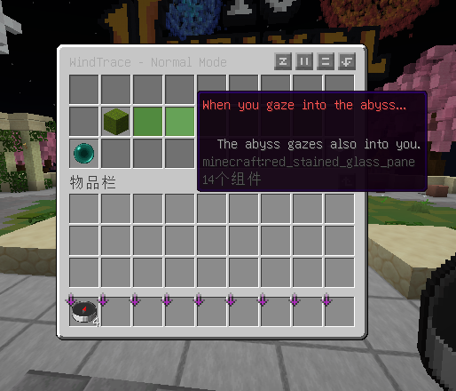
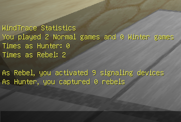

# 
WindTrace - Windchase MC Edition

[简体中文](README_zh.md)      [English](README_en.md)

This plugin allows you to add the popular gameplay mode "Windchase" from Genshin Impact, which is occasionally rerun, to your Minecraft server.

## If you are a regular player...

The game has two modes: Normal Mode and Winter Mode. The victory conditions for Rebels differ between the modes.

In the game, you will play one of the following roles:

- **Hunter**: Capture all Rebels in the game as quickly as possible to win. When there are 60 seconds left before the game ends, the Hunter is strengthened, gaining a significant speed boost and a reduced cooldown for **Capture!**.
- **Rebel**: In Normal Mode, you need to repair all Signaling Devices on the map as quickly as possible to win; in Winter Mode, you need to survive as long as possible until the game ends.

### Signaling Device

Appears in Normal Mode. By default, it takes 20 seconds for a single player to repair. Each additional player increases repair efficiency by 30%.

### Heat Source

Appears in Winter Mode. By default, it takes 5 seconds for a single player to activate. Once activated, it continuously reduces the cold value of nearby players.

### Cold Value

This mechanic exists in Winter Mode. When a player is a Rebel and not near a Heat Source, their cold value increases by 3 points per second. If the cold value reaches maximum, the player will be frozen for 10 seconds.

### Skills

The skills for each role are the same across all modes. We may consider adding more skills in the future.

**For Hunters:**

- **Aura of Detection**: Scan the surrounding area. If a Rebel is detected, mark their movement trail for 5 seconds. Cooldown 4s, 3 charges.
- **Capture!**: Reveal and capture a nearby Rebel, eliminating them instantly. Cooldown 5s, 3 charges. During the final 60 seconds of the game, this skill's cooldown is reduced to 3s.
- **Freezing Curse**: Randomly reveal one Rebel and freeze them for 10 seconds. They cannot leave the area and cannot be captured during this time. This is an **Ultimate Skill** obtained after picking up **Grace of Favor**.

**For Rebels:**

- **Vanishing Trick**: Become invisible for 5 seconds and remove your current disguise. Cooldown 30s.
- **Disguise**: Randomly transform into a block or remove disguise. No cooldown.
- **Swift Steps**: Greatly increase movement speed for 30 seconds. This is an **Ultimate Skill** obtained after picking up **Grace of Favor**.

> 💡 **Ultimate Skills** are obtained after picking up **Grace of Favor** and can only be used once per game.

### Commands

As a regular player, you can use the following commands:

- `/wt join` – Opens a menu listing available games, allowing you to select and join one.

- `/wt stats` – Use this command to view your statistics.

## If you are an administrator...

To create a map, follow these steps in order:

1. **Check dependencies**:

   Required:
    - [Holographic Displays](https://dev.bukkit.org/bukkit-plugins/holographic-displays)

   Optional:
    - [ProtocolLib](https://spigotmc.org/resources/protocollib.1997/)
    - [LibsDisguises](https://github.com/libraryaddict/LibsDisguise) (If not installed, errors may occur because I'm too lazy to fix bugs ~~)

> ~~Don't ask why Holographic Displays, which seems so insignificant, is a required dependency; the answer is that the code is a mess and hard to change [doge]~~

2. Stand at the lobby location and use the command `/wt setLobby` to set the lobby position. If you haven't done this step, you ***must*** do it (~~I won't tell you I'm too lazy to fix bugs~~); if you have already done it, you can skip this step.

3. Import the map using a multi-world plugin, then use `/wt create <map name> <display name>` to create the map. After creation, you can always use `/wt <map name>` to edit the map again.

4. Use the following commands to modify map attributes:
    - `/wt setCage` – Set the hunter's cage during the preparation phase.
    - `/wt setCenter` – Set the map center (the waiting area for players before the game starts and the teleport location after the game starts).
    - `/wt setDevice` – Set a Signaling Device / Heat Source.
    - `/wt removeDevice` – Remove a Signaling Device / Heat Source.
    - `/wt attributes mode <mode>` – Set the map mode. Available modes: `NORMAL`, `WINTER`.
    - `/wt attributes minPlayers <number>` – Set the minimum number of players. Default is 4.
    - `/wt attributes maxPlayers <number>` – Set the maximum number of players. Default is 4.
    - `/wt attributes hunterAmount <number>` – Set the number of hunters. Default is 1.
    - `/wt attributes addDisguiseBlock` – Add the block in your hand to the map's disguise list.
    - `/wt attributes removeDisguiseBlock` – Remove the block in your hand from the map's disguise list.

> Don't forget to use `/wt save` to save your changes after editing.

## What else to write...?

I wanted to write something else, but I forgot...
Oh, and remember to follow [XXBGames](https://space.bilibili.com/569992035)!!!

## Star History

